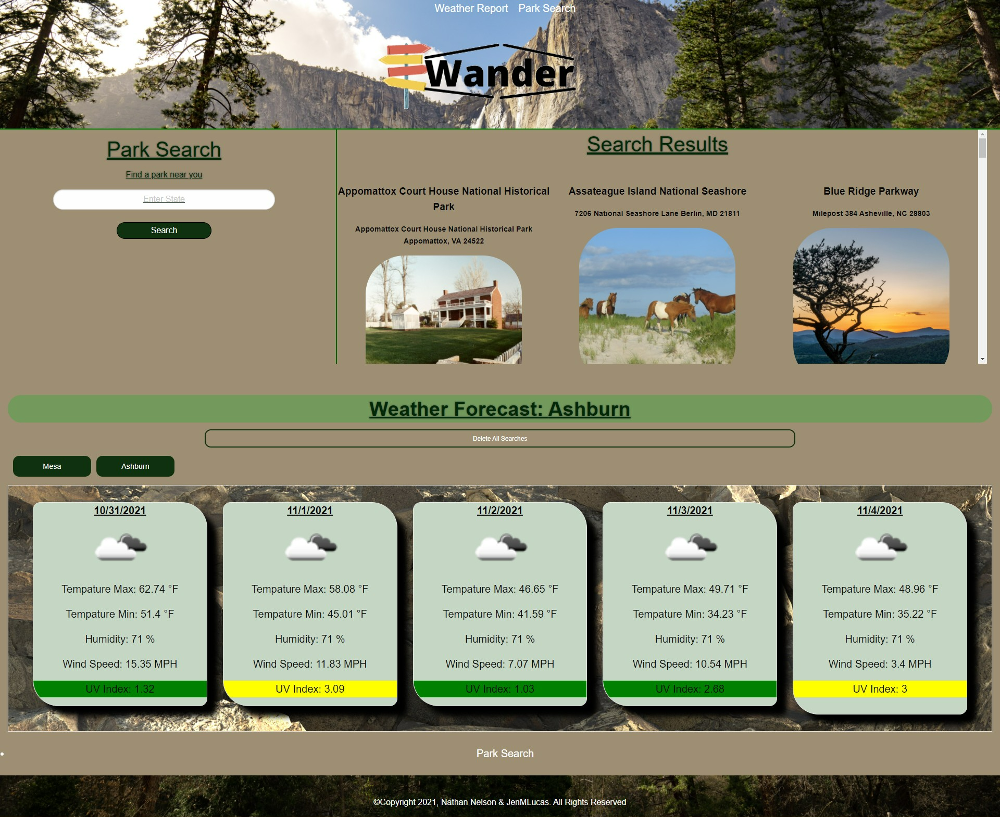

# Wander

## Description
 An interactive site that allows the user to search for National parks and their local 5 day weather forecast, in order to be able to prepare for any future activities. All search results are saved in local storage allowing for the user to repeatedly use the app without having to research for data. The weather forecast is made more user friendly by making the UV index color coded based on the weather conditions such as, favorable, moderate, and severe. 
 
## Production Website

[Wander](https://jenmlucas.github.io/parks-and-rec/ "Wander")
 

## Usage
What your site will look like on your device

    
## Credits

To give thanks to all who have helped create this product.

[OpenWeather Api](https://openweathermap.org/api/one-call-api "OpenWeather Api")

[National Parks Api](https://www.nps.gov/subjects/developer/api-documentation.htm#/activities/parks/getActvitiesParks "National Parks Api")

[Ip Address Api](https://ip-api.com/ "IP Address Api")

[Foundation](https://get.foundation/sites/docs/ "Foundation")

[University of Arizona Bootcamp](https://courses.bootcampspot.com "UofA")

[Stack Overflow](https://stackoverflow.com/questions/7549561/section-vs-article-html5/ "StackOverflow")

[MDN Web DOCs](https://developer.mozilla.org/en-US/docs/Web/HTML/Element/aside "MDN")

## License

©Copyright 2021, Nathan Nelson & JenMLucas. All Rights Reserved

## Badges

